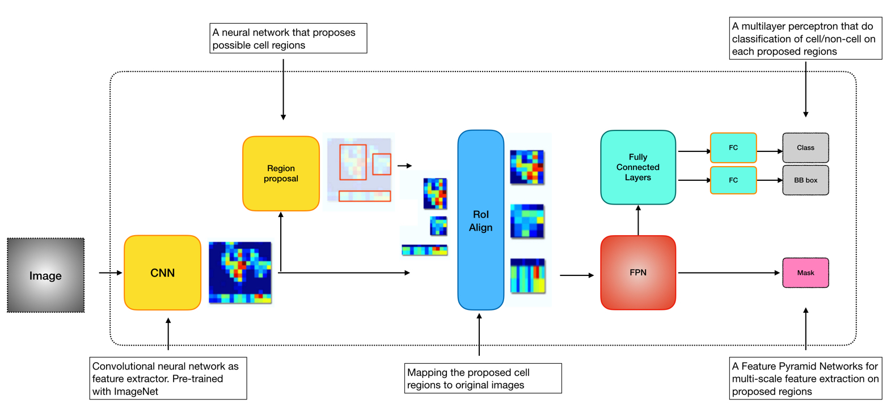

# Mask R-CNN for single-cell segmentation 

This implementation of Mask R-CNN is designed for single-cell instance segmentation in the context of multiplexed tissue imaging. The model generates bounding boxes and segmentation masks for each instance of an object in the image. The code is based on the implementation of Mask R-CNN by [Matterport](https://github.com/matterport/Mask_RCNN) in Python 3, Keras, and TensorFlow. The purpose of this Mask R-CNN implementation is to wrap its functions for ease of use and to provide a more streamlined pipeline for single-cell instance segmentation using Mask R-CNN.

Features:

* Optimized parameters for segmenting cells in multiplexed tissue imaging  

* Solution for segmenting batch and large images

* Support for training on custom datasets 

  

## Quick Start

### Installation 

* Set up programming environment and necessary dependencies

  * Set up conda for python environment management and cuda for GPU environment

  * Clone this repository 

  * Create a new conda environment with python 3.6 

  * ```bash
    conda env create -n maskrcnn_cell -f environment.yml
    source activate maskrcnn_cell
    python -m ipykernel install --user --name maskrcnn_cell
    ```

  * For GPU version tensorflow with specific cuda version :

  * ```bash
    pip install -r requirement_gpu_cuda10.txt
    ```

    or
    
    ```bash
    pip install -r requirement_gpu_cuda9.txt
    ```
    
    For CPU version tensorflow:
    
  * ```
    pip install -r requirement_cpu.txt
    ```

  * Install pycocotools

    ```bash
    pip install git+git://github.com/tryolabs/cocoapi.git#subdirectory=PythonAPI
    ```

* Install Mask R-CNN 

  * Run setup from the repository root directory

  * ```bash
    python setup.py install
    ```

### Usage

* Train on custom dataset. Demo: [train_custom_data.ipynb](./notebook/1.Image_segmentation_train.ipynb). 

  * Load data

  * Data augmentation

  * Adjust training parameters. Current parameters are optimized for 200X images

  * Set model backend and pretained weights

  * Training. 

  * Tip:

    * GPU is highly recommended for training 

    

* Predict segmentation on images using pre-trained model. Demo: [predict_segmentation.ipynb](./notebook/2.Image_Segmentation_prediction.ipynb) 

  * Load target images
  * Adjust prediction parameters
  * Predict segmentation on example image
  * Batch output. The model allows input of a list of images, and it will generate masks in JSON format together with the original image overlaid with the mask
  * Prediction on large image via stitching function. The model's memory usage depends on the maximum target number set in the prediction parameter and on the size of input image. For example, an input image of 1024x1024 pixels with 3500 max prediction could take 8 GB of memory. 
  * Tip: 
    * CPU or GPU? Prediction can be performed in a CPU environment, and since most CPU setups provide more memory than GPUs, it is actually cheaper and more stable to perform prediction in a CPU environment. 


## Model Architecture




## Future plan
- [x] Change the mask file format from running length encoding to coco json formart.
- [x] Seamless stitching for large images

## Note

* The notebook here is just for demo purpose. Data are not included.

## Acknowledgement 

This work is supported by 
* [The Alan and Sandra Gerry Metastasis and Tumor Ecosystems Center](https://www.mskcc.org/research-programs/metastasis-research)
* [Human Tumor Atlas Network](https://www.cancer.gov/research/key-initiatives/moonshot-cancer-initiative/implementation/human-tumor-atlas)
* [Parker Institute for Cancer Immunotherapy](https://www.parkerici.org/)


## Reference

He, K., G. Gkioxari, P. Dollár, and R. Girshick. 2017. “Mask R-CNN.” In *2017 IEEE International Conference on Computer Vision (ICCV)*, 2980–88. [link](https://arxiv.org/abs/1703.06870)

https://github.com/matterport/Mask_RCNN 

https://medium.com/@jonathan_hui/image-segmentation-with-mask-r-cnn-ebe6d793272
